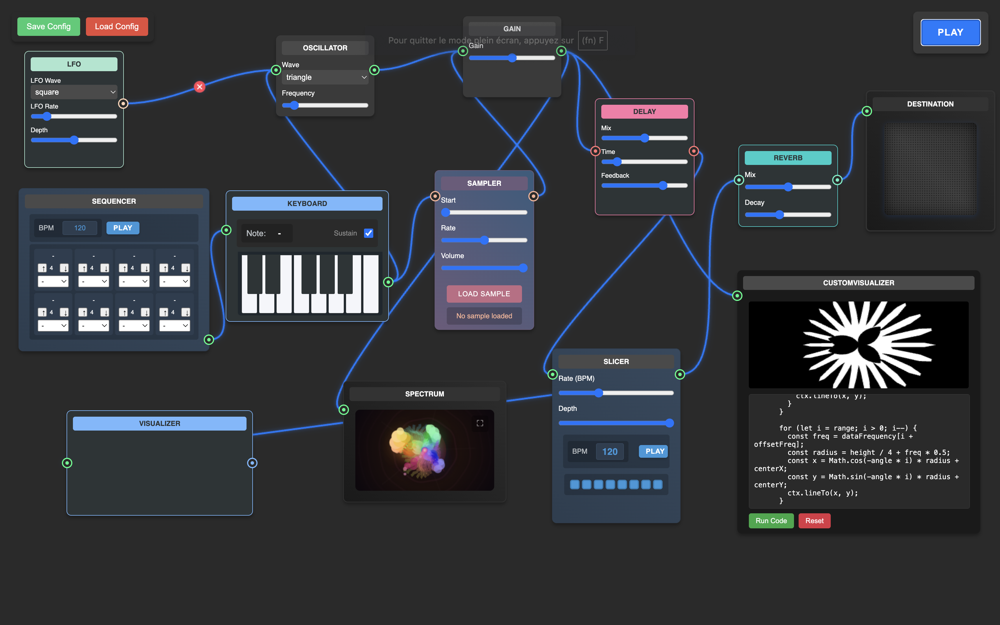

# 🎹 AudioNode Experiment

An advanced audio synthesis and visualization playground built with Web Audio API and pure Vanilla JavaScript. Create complex audio routing, modular synthesis, and stunning real-time visualizations.

## ✨ Features

- 🎛️ Modular Audio System

  - Oscillators with multiple waveforms
  - LFO for modulation
  - Gain control
  - Delay effects
  - Reverb processing

- 📊 Visualizations

  - Waveform display
  - Spectrum analyzer
  - Custom visualization module
  - Fullscreen visualization support

- 🔌 Dynamic Patching

  - Drag-and-drop connections
  - Visual connection paths
  - Easy routing management

- 🎹 Musical Control

  - Virtual keyboard interface
  - Step sequencer for rhythmic patterns
  - Sample loading and playback
  - Note triggering with computer keyboard
  - Adjustable tempo and timing controls
  - Pattern storage and recall
  - Octave switching

## 🚀 Getting Started

### Prerequisites

- Node.js (v14.0.0 or higher)
- Modern web browser with Web Audio API support

### Installation

1. Clone the repository:

   ```bash
   git clone https://github.com/yourusername/audionode-experiment.git
   cd audionode-experiment
   ```

2. Install dependencies:

   ```bash
   npm install
   ```

3. Start the development server:

   ```bash
   npm run dev
   ```

4. Open your browser and navigate to:

   ```
   http://localhost:5173
   ```

The application should now be running in your browser.

## 🎮 How to Use

### Basic Audio Flow

1. Every audio connection starts from a source (like an Oscillator) and ends at the destination (your speakers)
2. Connections are made by dragging from an output (right side) to an input (left side)
3. The master output is always available at the bottom right of the workspace

### Quick Start Example

1. Connect Oscillator output → Gain input
2. Connect Gain output → Destination input
3. Click the global "Play" button at the top
4. Adjust the Gain value to control volume
